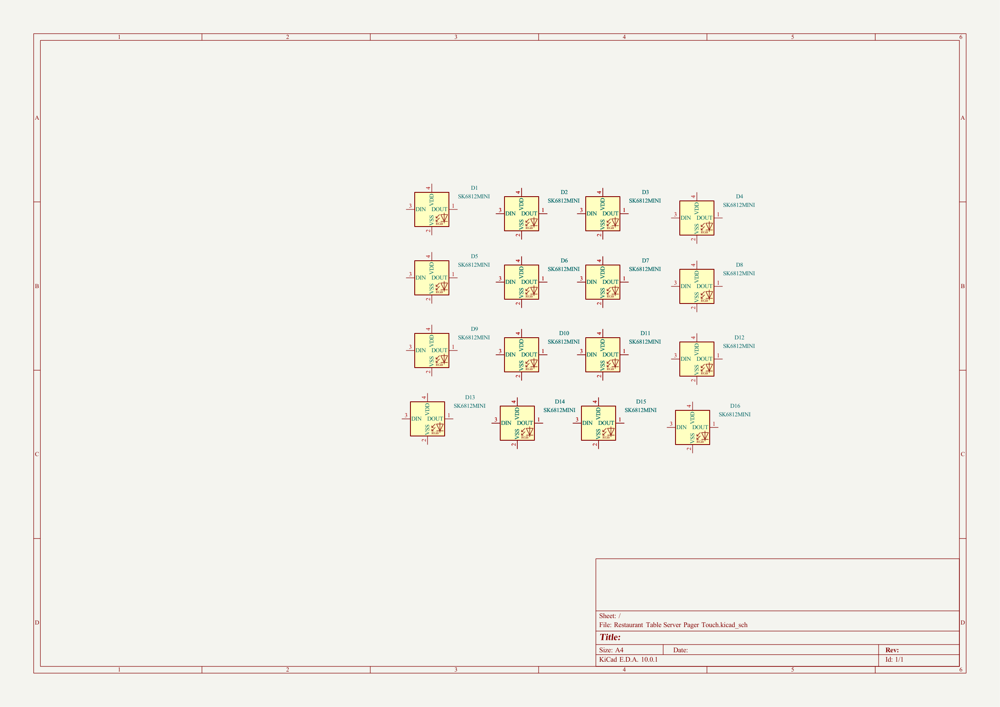

# Restaurant Table Server Pager Touch

Addressable SK6812MINI RGB LED pager - restaurant table-to-server call signal

## At a Glance

- **Status**: Partial / WIP
- **Board size**: 160 x 160 mm
- **Layers**: 2
- **Components**: 16

## Schematic

Full PDF: [reports/schematic.pdf](reports/schematic.pdf)

## Component Roles

- **SK6812MINI** x16+ (D1-D16) - addressable RGB LEDs in a single-wire daisy chain; one data line drives the entire string
- Each LED carries its own driver + memory cell, so a single MCU GPIO can address each individually for animated patterns / per-table indicators

> **Status**: 16 footprints placed, no routing yet. Sheet sized to A2 to fit the full pager layout. Driver MCU is not on this board (external).

## PCB

**Top copper**

**Bottom copper**

## Bill of Materials

| Refs | Value | Footprint | Qty | MPN | LCSC |
|------|-------|-----------|----:|-----|------|
| D1-D16 | SK6812MINI | LED_SMD:LED_SK6812MINI_PLCC4_3.5x3.5mm_P1.75mm | 16 |  |  |

_1 of 1 line items don't have an LCSC code in the schematic - search [LCSC](https://www.lcsc.com/) or [JLC parts search](https://jlcsearch.tscircuit.com/) by MPN or footprint when sourcing._

## Files

- `Restaurant Table Server Pager Touch.kicad_pro` - KiCad project
- `Restaurant Table Server Pager Touch.kicad_sch` - schematic source
- `Restaurant Table Server Pager Touch.kicad_pcb` - PCB layout source
- `reports/schematic.pdf` - full schematic (printable)
- `reports/bom.csv` - bill of materials
- `reports/pcb-top.svg`, `reports/pcb-bottom.svg` - copper artwork
- `reports/board-stats.json` - KiCad-generated board statistics

---

_Renders and metadata auto-generated by `Backup-KiCadProject.ps1` using KiCad 10.0._

