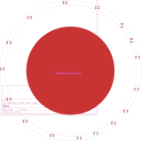

# Restaurant Table Server Pager Touch

Addressable SK6812MINI LED pager board for restaurant table-to-server alerts

## At a Glance

- **Status**: Partial / WIP
- **Board size**: (unknown)
- **Layers**: 2
- **Components**: ?

## Renders

**PCB top**

**PCB bottom**

## Files

- `Restaurant Table Server Pager Touch.kicad_pro` - KiCad project
- `Restaurant Table Server Pager Touch.kicad_sch` - schematic source
- `Restaurant Table Server Pager Touch.kicad_pcb` - PCB layout source
- `reports/schematic.pdf` - full schematic (printable)
- `reports/bom.csv` - bill of materials
- `reports/pcb-top.svg`, `reports/pcb-bottom.svg` - copper artwork
- `reports/board-stats.json` - KiCad-generated board statistics

## Notes

A2 sheet, 16+ SK6812 LEDs, partial layout

---

_Renders and metadata auto-generated by `Backup-KiCadProject.ps1` using KiCad 10.0._

